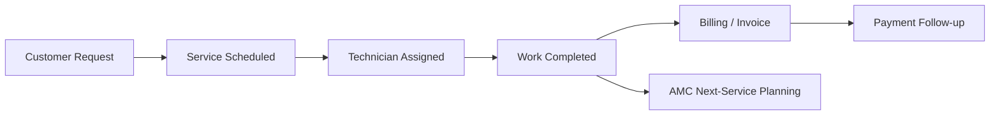
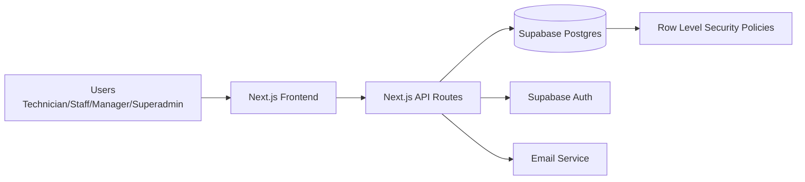
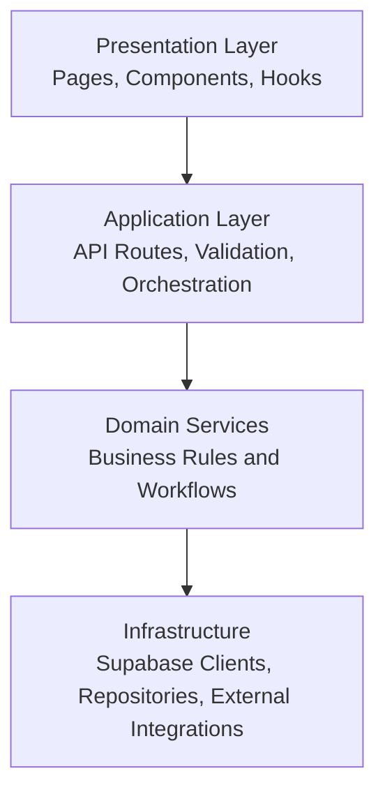
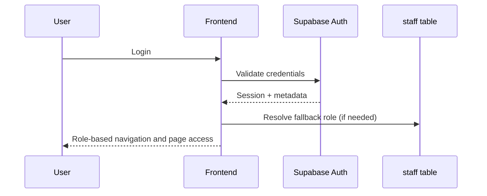
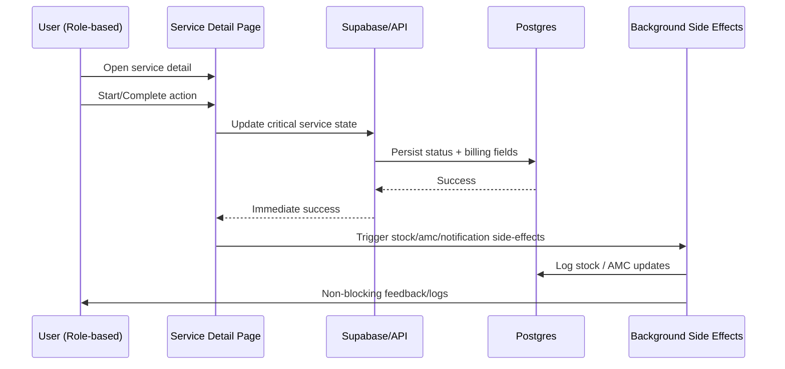

# Aqua Service Manager

Professional project documentation for Base Water Chemicals.

> Document format: **Part A (Client-Facing)** + **Part B (Internal Engineering)**

---

## Part A) Client-Facing Documentation

This section is for business stakeholders, operations leaders, and client-side decision makers.

### A.1 Executive Business Summary

Aqua Service Manager is a business operations platform for water filter service companies. It helps teams manage customer requests, field service execution, recurring AMC visits, invoice follow-up, and staff workflows from one system.

### A.2 Business Outcomes Delivered

- Reduced turnaround time from service completion to billing visibility
- Better accountability for field and office teams
- Reduced access-risk by strict role-based controls
- Faster customer servicing due to operational dashboards and filters
- Better continuity of recurring AMC service commitments

### A.3 Who Uses the System

- **Technician**: Executes assigned field services and closes daily work
- **Staff**: Supports service operations, updates records, and billing workflows
- **Manager**: Monitors branch operations and delivery performance
- **Superadmin**: Governs people, permissions, and sensitive controls

### A.4 Client-Facing End-to-End Business Flow

### A.5 Role Journey Summary (Client View)

#### Technician Journey
- Receives daily service queue
- Opens service detail and performs work
- Marks service complete with work details and parts
- Moves to next assignment with minimal delay

#### Staff Journey
- Creates and updates service/customer records
- Supports invoice workflows and day-book operations
- Assists operational follow-up and data quality

#### Manager Journey
- Reviews branch-level operational progress
- Tracks pending work and dues trends
- Coordinates team throughput and issue escalation

#### Superadmin Journey
- Controls staff lifecycle and permissions
- Handles sensitive actions (credential resend, staff delete)
- Enforces governance and process correctness

### A.6 Feature Showcase (Client Perspective)

1. Role-based dashboards
2. Service lifecycle management
3. AMC recurring planning
4. Invoice and dues visibility
5. Inventory-aware service closure
6. Staff governance and secure credential workflows

### A.7 Business Case Study (Before vs After)

#### Before
- Slow completion experience during side-effect-heavy service closing
- Mixed access visibility across modules
- Manual effort to manage recurring service continuity

#### After
- Near-instant service completion response by moving non-critical side effects out of blocking path
- Role-safe module access (for example, invoice restrictions for technicians)
- Better recurring AMC continuity and operational confidence

### A.8 Client Demo Screenshots (Placeholders)

> Replace these placeholder paths with actual PNG/JPG screenshots from your app.

#### Dashboard

#### Service List

#### Service Completion Dialog

#### Technician Focused Dashboard

#### Invoice Module (for authorized roles)

#### Staff Management (superadmin)

### A.9 Value Proposition Statement

Aqua Service Manager transforms fragmented service operations into a controlled, role-safe, measurable workflow engine for day-to-day business execution.

---

## Part B) Internal Engineering Documentation

---

## 1) Document Purpose

This document is the official, comprehensive reference for the Aqua Service Manager platform, covering:

- Product vision and business context
- Technical architecture and stack
- Security and access control model
- End-to-end user flows
- Full role-by-role scenario catalog
- Module-level functional behavior
- Operational and business use cases
- Current implementation journey (from start to present)
- Future scope and roadmap

---

## 2) Product Overview

Aqua Service Manager is a role-based operational platform for water filter businesses that unifies customer management, service operations, AMC lifecycle execution, invoicing, inventory usage, expense tracking, and staff governance.

### 2.1 Business Problem It Solves

Before this system, typical business pain points included:

- Service schedules tracked across multiple disconnected tools
- Delays in turning completed services into billable records
- Weak accountability on who created or completed records
- Inconsistent follow-up for AMC recurring visits
- Role confusion (too much visibility for some users, too little for others)
- Operational delays due to blocking email/notification workflows

### 2.2 Business Outcome Goals

- Faster daily service execution
- Better visibility of dues and pending work
- Safer role-based operation of sensitive modules
- Strong auditability for operational events
- Scalable foundation for branch growth and future automation

---

## 3) Scope of the Platform

### 3.1 In-Scope Functional Areas

- Authentication and role-aware dashboard experience
- Customer records and customer-linked service history
- Service request lifecycle (schedule → assign → execute → complete)
- AMC recurring service support
- Invoice generation and payment-status monitoring
- Inventory-linked service parts usage
- Expense and day-book style operational accounting
- Staff lifecycle operations and credential resend flows
- Branch and settings management

### 3.2 Out-of-Scope (Current Phase)

- Native mobile app
- Multi-tenant white-label management
- Queue infrastructure for guaranteed delivery retries
- Advanced BI/analytics data warehouse layer

---

## 4) Technology Stack

### 4.1 Frontend

- Next.js (App Router)
- React 19
- TypeScript (strict mode)
- Tailwind CSS
- Radix-based UI primitives
- Sonner toasts
- Recharts for visualization

### 4.2 Backend and Data

- Next.js API routes
- Supabase Postgres
- Supabase Auth
- Supabase Row Level Security (RLS)

### 4.3 Domain/Utility Libraries

- Zod (validation)
- React Hook Form
- jsPDF + jsPDF autotable
- Nodemailer

### 4.4 Build and Quality Tooling

- ESLint
- TypeScript compiler checks
- Next.js production build pipeline

---

## 5) System Context and Architecture

### 5.1 Context Diagram

### 5.2 Layered Architecture

### 5.3 Architectural Principles

1. Clear layer boundaries
2. Least-privilege authorization
3. Deterministic critical writes
4. Background execution for non-critical side effects
5. Build-time type safety and runtime validation

---

## 6) Data, Security, and Access Model

### 6.1 Authentication

- User identity via Supabase Auth
- Session-aware role resolution

### 6.2 Role Resolution Strategy

Current role resolution prioritizes:

1. `user.user_metadata.role` (primary)
2. `staff` table fallback
3. default fallback behavior where applicable

This avoids access failures when staff rows are delayed or temporarily missing.

### 6.3 Authorization Controls

Authorization is enforced at two levels:

- UI level (navigation and page-level guards)
- API level (hard authorization checks for privileged operations)

### 6.4 RLS and Sensitive Data

- RLS enabled for sensitive tables
- Email delivery logs are protected by role-based policies

### 6.5 Sensitive Operations (Current Enforcement)

- Staff management operations: superadmin-only at API access gates
- Staff deletion: superadmin-only, self-delete blocked, dependency reassignment required
- Credential resend: superadmin-only
- Invoice module: technician blocked in navigation + page redirect guard

---

## 7) Module Catalog

### 7.1 Dashboard

- Role-aware dashboard rendering
- Technician dashboard variant focuses on execution-only insights

### 7.2 Customers

- Create/view/edit customer records
- Link customer identity to service and invoice records

### 7.3 Services

- Service list with filters (status/time/type/search)
- Service detail lifecycle actions (start, complete, AMC logic)
- Service completion captures work details, parts usage, billing figures

### 7.4 AMC Workflows

- Recurring scheduling based on interval
- Completion-driven updates to AMC contract state
- Next-service generation where no duplicate scheduled service exists

### 7.5 Invoices

- Invoice list, details, edit/new workflows
- Technician access restricted

### 7.6 Inventory

- Product/category management
- Service completion can deduct inventory using stock transaction RPC

### 7.7 Expenses and Day Book

- Operational finance tracking
- Day-wise accounting context

### 7.8 Staff

- Staff create/activate/deactivate/delete
- Credential resend
- Branch requirement for staff/technician role creation

### 7.9 Branches and Settings

- Branch management and configuration controls

---

## 8) Full User-Flow Reference

## 8.1 Global Login and Navigation Flow

## 8.2 Service Lifecycle Flow

---

## 9) Role-Wise Complete Scenario Catalog

This section is ordered exactly as requested:
1) Technician
2) Staff
3) Manager
4) Superadmin

For each role, scenarios include happy-path and edge/failure behavior.

---

## 9.1 Technician — Complete Scenarios

### A) Authentication and landing

- Technician logs in successfully.
- Role is resolved via metadata-first logic.
- Technician sees dashboard and allowed modules only.

### B) Dashboard behavior

- Technician dashboard shows focused operational data:
  - Today’s assigned services
  - Dues summary related to service outcomes
  - Stock status visibility (low-stock awareness)
- Non-technician cards (broad management analytics) are hidden.

### C) Allowed navigation scenarios

Technician can access:

- Dashboard
- Day Book
- Customers
- Services
- Service Calendar

Technician cannot access:

- Invoices (hidden in nav; direct route redirects)
- Inventory module
- Expenses module
- Branches
- Staff module
- Settings

### D) Service execution scenarios

1. **View assigned service list**
   - Technician sees services relevant to assignment/date context.
2. **Open service detail**
   - Technician sees customer/schedule/billing details.
3. **Start service**
   - Status changes to `in_progress`.
4. **Complete service**
   - Enter work done
   - Add parts used (manual or from stock)
   - Add charges, discount, tax
   - Save completion
5. **AMC service already done flow**
   - If applicable and action visible, can mark done and trigger next cycle logic.

### E) Completion edge/failure scenarios

- If completion update fails, UI shows failure toast.
- If stock deduction fails for a part, warning appears but completion remains successful.
- Notification failure does not block completion success.
- AMC background operation errors are logged; user is not blocked by non-critical side effects.

### F) Business value for technician

- Fast closeout of field jobs
- Reduced app waiting time during completion
- Clear daily focus with minimal operational noise

---

## 9.2 Staff — Complete Scenarios

### A) Authentication and landing

- Staff login succeeds with role resolution.
- Staff is redirected away from dashboard if dashboard access disallowed by policy.

### B) Navigation scenarios

Staff can access:

- Day Book
- Customers
- Services
- Service Calendar
- Invoices
- Inventory
- Expenses

Staff cannot access:

- Staff management module (effective enforcement)
- Branches management
- Settings

### C) Service workflow scenarios

1. Create new service from service creation page.
2. Filter/search services by date/status/type.
3. Open service detail and execute lifecycle actions permitted by page state.
4. Complete service with parts, billing and notes.

### D) Invoice workflow scenarios

- View invoice list and detail
- Create and edit invoices where role policy allows
- Use date/status/search filters

### E) Inventory linkage scenarios

- During service completion, staff can use stock-linked item selection.
- Stock updates are logged via transaction RPC.

### F) Edge/failure scenarios

- Validation failures (required fields, invalid values) return user-readable errors.
- Unauthorized API actions return `FORBIDDEN` responses.

### G) Business value for staff

- End-to-end processing of service-to-billing operations
- Lower manual reconciliation effort
- Better visibility of pending and completed operational tasks

---

## 9.3 Manager — Complete Scenarios

### A) Authentication and landing

- Manager lands on full operational dashboard experience.

### B) Navigation scenarios

Manager can access:

- Dashboard
- Day Book
- Customers
- Services
- Calendar
- Invoices
- Inventory
- Expenses
- Branches
- Settings

Manager should not perform superadmin-only staff operations (API-enforced).

### C) Operational scenarios

1. Monitor service throughput and status distribution.
2. Review pending items and payment-related indicators.
3. Oversee branch operations via branch module (if configured).
4. Support scheduling and execution supervision.

### D) Branch and team coordination scenarios

- Ensure correct branch-level operational work partitioning.
- Review workloads and service states for planning.

### E) Edge/failure scenarios

- If manager attempts a superadmin-only staff action, API denies with authorization error.

### F) Business value for manager

- Better daily planning and branch coordination
- Faster issue detection through dashboard and filtered module views

---

## 9.4 Superadmin — Complete Scenarios

### A) Authentication and full platform access

- Superadmin has the highest operational control.

### B) Staff module scenarios (full lifecycle)

1. **List staff**
   - Fetch staff with branch relation resolution.
2. **Create staff**
   - Create auth user + staff record
   - Enforce role-creation constraints and password length rules
   - Enforce branch requirement for staff/technician roles
   - Send credentials email in background
3. **Activate/deactivate staff**
   - Toggle active status
   - Prevent self-deactivation
4. **Resend credentials**
   - Update auth password
   - Trigger resend email in background
   - Log failures in email logs table
5. **Delete staff safely**
   - Prevent self-delete
   - Reassign dependent records to active manager/superadmin
   - Delete staff + linked auth user

### C) Service control scenarios

- Reschedule service action available to superadmin in permitted states.
- Delete scheduled service action available to superadmin.

### D) Governance scenarios

- Enforce policy correctness through role access controls.
- Handle escalated operational exceptions.

### E) Edge/failure scenarios

- Missing service-role key returns server misconfiguration response.
- Reassignment target missing blocks deletion with explicit error.
- Auth deletion failure after DB delete returns partial-failure diagnostic.

### F) Business value for superadmin

- Centralized governance and risk control
- Controlled lifecycle management of users and sensitive operations

---

## 10) End-to-End Scenario Matrix

| Scenario | Technician | Staff | Manager | Superadmin |
|---|---:|---:|---:|---:|
| Login and role resolution | ✅ | ✅ | ✅ | ✅ |
| Access dashboard | ✅ | ❌ (redirect policy) | ✅ | ✅ |
| View services list/detail | ✅ | ✅ | ✅ | ✅ |
| Start service | ✅ | ✅ | ✅ | ✅ |
| Complete service | ✅ | ✅ | ✅ | ✅ |
| Mark AMC already done (when shown) | ✅ | ✅ | ✅ | ✅ |
| Service reschedule | ❌ | ❌ | ❌ | ✅ |
| Service delete (scheduled) | ❌ | ❌ | ❌ | ✅ |
| Access invoices | ❌ | ✅ | ✅ | ✅ |
| Access inventory module | ❌ | ✅ | ✅ | ✅ |
| Access expenses module | ❌ | ✅ | ✅ | ✅ |
| Access branches module | ❌ | ❌ | ✅ | ✅ |
| Access staff module page | ❌ | ❌ | ❌ (effective) | ✅ |
| Create/activate/deactivate staff | ❌ | ❌ | ❌ (effective) | ✅ |
| Resend staff credentials | ❌ | ❌ | ❌ (effective) | ✅ |
| Delete staff | ❌ | ❌ | ❌ | ✅ |

> Note: Some constants still list broader roles for staff menu entry, but effective runtime/API enforcement for staff management is superadmin-only.

---

## 11) API Behavior Summary

### 11.1 Staff API (`/api/staff`)

- `GET`: list staff (privileged)
- `POST`: create staff (privileged)
- `PATCH`: update active status (privileged)
- `DELETE`: delete with reassignment (superadmin)

### 11.2 Staff Resend API (`/api/staff/resend`)

- `POST`: password reset for selected staff + credentials resend email (superadmin)

### 11.3 Services API (`/api/services`)

- `GET`: paginated and filtered service retrieval
- `POST`: service creation for allowed roles

### 11.4 Other APIs (current platform)

- customers
- invoices
- inventory categories/products/transactions
- expenses
- settings
- notifications
- cron reminder route
- chatbot route

---

## 12) Performance and Reliability Engineering

### 12.1 What was improved

Primary bottleneck observed:

- Service completion took ~30s to 60s in some cases.

Improvements implemented:

- Parallelized stock deductions
- Parallelized AMC check/update blocks where safe
- Moved notifications to background
- Kept critical service update in synchronous path
- UI updated immediately after critical write success

### 12.2 Reliability behavior after optimization

- Completion success is not blocked by non-critical side effects.
- Background side-effect failures are captured without breaking core operation.

---

## 13) Business Use Cases and Case Study

### 13.1 Core business use cases

1. **Daily service execution**
   - Assign and complete services quickly.
2. **AMC continuity**
   - Ensure recurring visits are not missed.
3. **Revenue operations alignment**
   - Convert completed work into billable and trackable outputs.
4. **Operational governance**
   - Restrict sensitive user-management operations.

### 13.2 Mini case study (operational)

**Problem observed**: completion flow had high latency due to sequential operations and notification waits.

**Intervention**:
- Side-effects moved to parallel/background paths.
- Critical path minimized to only essential write operations.

**Result**:
- Completion responsiveness improved significantly for end users.
- Operational throughput confidence increased.

---

## 14) Project Journey (Start to Current)

### Phase 1 — Foundation and architecture planning

- Established layered architecture guidance.
- Defined clean separation patterns and migration direction.

### Phase 2 — Staff and access-control hardening

- Fixed ambiguous branch relation issue in staff query.
- Introduced superadmin-controlled staff operations.
- Implemented safe deletion and reassignment strategy.
- Added credential resend with failure logging.

### Phase 3 — Role-resolution and UX improvements

- Metadata-first role resolution fix.
- Sidebar logout redirect fix.
- Technician-focused dashboard introduced.

### Phase 4 — Performance optimization

- Investigated service completion delay.
- Refactored completion path to parallel/background side effects.
- Verified compile/build stability.

### Phase 5 — Access consistency updates

- Removed technician invoice module access in nav and page-level route.

### Current state

- Build stable
- Role controls stronger
- Service completion UX significantly faster
- Documentation now standardized and comprehensive

---

## 15) Operational Runbook

### 15.1 If service completion seems slow

1. Confirm critical DB write latency first.
2. Inspect background task logs for stock/AMC/notification exceptions.
3. Validate database indexes for high-frequency filters.

### 15.2 If role access seems wrong

1. Confirm metadata role in auth user.
2. Check fallback role row in `staff` table.
3. Verify UI nav role list and server authz function alignment.

### 15.3 If credentials email fails

1. Check `email_delivery_logs` entries.
2. Validate email environment credentials.
3. Retry via resend flow.

---

## 16) Risks and Mitigations

### Risk: UI and API role rule drift

- Mitigation: maintain single source-of-truth permission matrix and test against API checks.

### Risk: background side-effect invisibility

- Mitigation: stronger structured logging and dashboard visibility for failed async jobs.

### Risk: data reassignment complexity during deletion

- Mitigation: explicit reassignment checks and failure-safe responses.

---

## 17) Future Scope

### 17.1 Product scope expansion

- Multi-branch KPI dashboards
- Advanced role-policy matrix tooling
- Workflow automation for reminders/escalations
- Queue-backed notification/side-effect processing

### 17.2 Engineering scope expansion

- Integration test suite for role-based flows
- End-to-end tests for critical business scenarios
- Structured observability with metrics dashboards
- Dead-letter handling for failed background jobs

---

## 18) Appendix — Professional A-to-Z Reference

### A — Authentication
Supabase Auth-backed identity with role-aware UI/API behavior.

### B — Branches
Branch-level organization and visibility management.

### C — Customers
Customer master data tied to service and billing contexts.

### D — Dashboard
Role-specific operational cockpit.

### E — Email
Background credential and customer notification workflows.

### F — Flows
Deterministic lifecycle progression and state transitions.

### G — Governance
Superadmin-sensitive controls and policy enforcement.

### H — Hooks
Frontend hooks abstract data operations and UI state.

### I — Invoices
Billing workflows with technician restriction.

### J — Journey
Incremental hardening and performance improvements across phases.

### K — Keys
Service-role keys used server-side for privileged operations.

### L — Logs
Email failure and operational diagnostics.

### M — Modules
Customers, services, AMC, invoices, inventory, expenses, staff, branches, settings.

### N — Notifications
Customer communications for service events.

### O — Operations
Business process management from field to finance.

### P — Performance
Parallel and asynchronous side-effect execution.

### Q — Quality
Type-safe build checks and controlled release changes.

### R — Reliability
Critical-path protection + non-blocking side effects.

### S — Security
RLS + authorization checks + role-based surface control.

### T — Technicians
Execution-first UX and restricted module scope.

### U — User Experience
Fast feedback loops and reduced operational friction.

### V — Validation
Request validation and business-rule checks.

### W — Workflows
Service, AMC, invoice, and staff governance workflows.

### X — eXecution
Action-centric and state-driven runtime behavior.

### Y — Yardstick
Operational success measured by speed, correctness, and governance.

### Z — Zero-Trust
Never rely solely on client controls; enforce server authorization always.

---

## 19) Final Statement

This documentation is now rewritten as a professional project specification and operations guide, with complete role-wise scenarios (technician, staff, manager, superadmin), user flows, architecture diagrams, business use cases, implementation journey, and future scope.

---

## 20) Engineering Screenshots (Placeholders)

> Replace these paths with implementation-oriented screenshots for internal documentation and onboarding.

### 20.1 Architecture and Flows

### 20.2 API and Security

### 20.3 Performance and Reliability

### 20.4 Build and Release

### 20.5 Suggested Screenshot Capture Checklist

1. Login and role detection
2. Sidebar per role (technician/staff/manager/superadmin)
3. Dashboard differences by role
4. Service completion dialog and result state
5. Staff create/resend/delete actions
6. Invoice access restriction for technician
7. Build output and branch commit history
